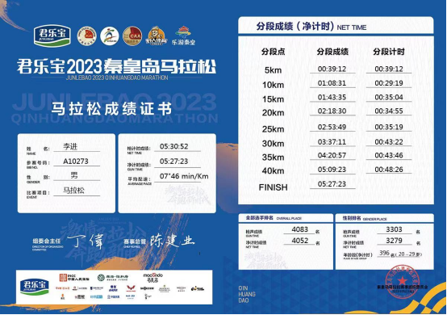
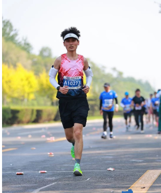
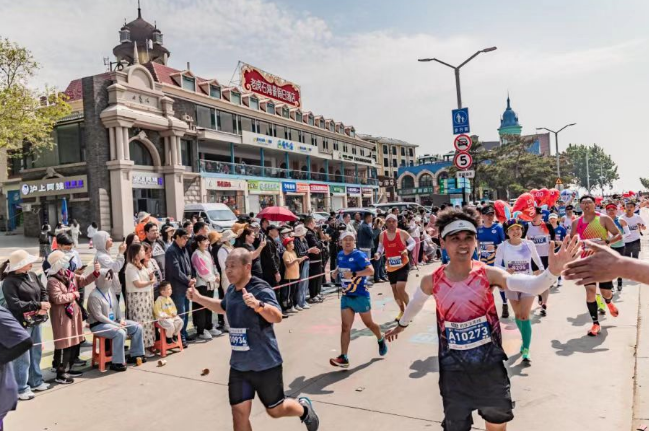
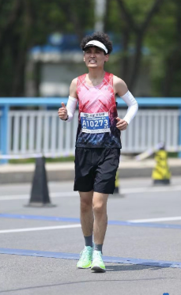
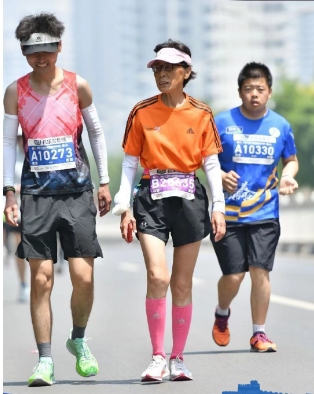
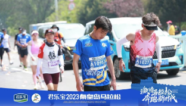

​		朋友问我，“你咋想着去跑马拉松？”	

​		我妈跟我说，“你不要再跑了，出力过了对身体不好，一定要注意身体”。其实，真要说是多么热爱，我答不上来。或许我也一直在寻找答案。

​		如果说，是得到了什么？

​		认识了新朋友，增强了心理建设，营造了所谓的运动人设，好像这些都不错。

​		那失去呢？

​		省了周末早上的懒觉，晚上下班有几天回家晚些，当然也没少跛着腿走路。当然还有最惨的一件，辛苦吃的

一个月长出的肉，又交代回去了。（这当然不是在凡尔赛，我是多喜欢看到自己脸颊有肉的样子）

​		你瞧，我好像放弃了也有很多。

​		所以，我坚持下去的原因是什么呢？

​			

​		其实这次成绩蛮差的，并不太意愿贴出来（你瞧，我仍是这么肤浅）。可有时候命运的安排就是这么奇妙，你越是不想做的事，它偏偏能生出一万种让你做下

去的理由。总当是分享了， 毕竟写出来，对我而言再简单不过了。

​		这次的马拉松，经历了找错起点，发枪前两分钟才踉踉跄跄地来到在拱门前。站在发枪点的时候，早已经是满头大汗，整理好装备，刚弓步拉伸完一条腿，队

伍就浩浩荡荡开冲了（干啥，冲鸭，歇脚的事是留个刘姥姥做的）。冲过拱门好几米，才想起按手表，连目标距离也顾不上设置。便顶着160的心率，在6分多的 

倍速，随入了人流里。

​		两公里的时候，脚腕就开始发疼。坚持到5公里，髂胫束的老毛病也来了（你要问我，髂胫束是啥，大概就是屁股软弱无力，所引发的腿部综合征）。送走了

迷你跑的大队，站在第一个五公里补给点。第一件事就是赶紧拉伸，这对我而言再熟悉不过了。一套动作下来，人流已经基本见底。吃了片盐丸，漱了漱口，就赶

紧出发。当下我是信心满满，干劲不足，速度也快了不少。6，7公里处追到了6小时的关门兔，10公里的时候，脚腕和膝盖还是疼，不过遇到了热心的医疗老哥，

给我掰了掰腿，轻松了很多。（起初我是拒绝的，这太难为情了，不过挨不过老哥的热情，讲真的，是真的好有用，感谢老哥）。

​		12公里处又追到5小时的兔子，然后就是一段最最轻松，愉快的旅程。

​		“上坡不要急，压着腿，倍速慢一点没事。”

​		“前面还有几个坡呢？”

​		“十八公里有一个，再然后就是40公里的时候。”

​		兔子姐姐，很开朗，也很健谈。她跑了五年步了，去年跑到345，很厉害。

​		“我这会心率才110。”

​		额，，，我低头看了眼表，168。抬手擦了擦额头的盐粒子，紧紧跟上去。

 

​		跑到20公里鼓乐宣天的中央广场（我也不知道叫啥名字，但叫它这名字准没错），高台中央的LED屏，闪烁着动人的话语，“风儿撩起你的发，那是青春唱起

歌，每束阳光都不回首，却替你，吻过我额头”。站台上两排青春活力的啦啦队员，左右摇晃着手上的编织彩带，再配合露天音响发出的节奏感十足的音乐，活脱

脱营造出一处氛围感十足的天地来。我的肾上腺速被急速拉升，身体上的疲惫清消了许多，脚下的步子也快了不少。（不得不感叹，这就是群众的力量）。竟也学

着前面的人，同路边的志愿者一个个击掌。有趣的是，恰好被镜头捕捉到，连续登上赛后的文章版面，朋友们也戏称，这得给我加钱。

（可这拍的也太黑了，有没有可能本来就这么黑）。

​		这样的轻松，一直持续到28公里处，那会我已经小小超过兔子姐姐。我觉得自己可以快一些到达下一个补给点，这样给腿上喷一点喷雾，也能多出一些时间调

整。我真是太年轻了，根本没有体会过，什么叫做长跑的撞墙。28公里处的道路十分宽敞（宽敞到只剩太阳），那会阳光正好，两边也基本没有任何能遮挡阴凉的

地方。路沿左边是石块砌成的半米高的路墙，上面偶尔能伸出几道带着绿叶的枝叉，行成一角细碎阴凉处。

​		突然，我的右腿“腾的一声”立住了。我感觉到，大腿底下好像有一根弹簧连同血肉嘣起，刹那时脑子也开始嗡嗡作响。就这样这跟弹簧紧紧拧住我整条腿，连

带着脚底板一起，钉在了地上。我只要敢动，大概率就只剩下哭了。

​		“完了，我抽筋了”，就这样楞在原地。

​		旁边2米的地方就有一个戴着白色空顶帽的志愿者。那一刻，我脑子里闪现出无数糟糕的画面，这其中就包括刚刚救护车疾驰闪过的画面，这太可笑了。

还有整整15公里，看来这次所谓的励志旅行，大概率要成为一场闹剧，原来这就是我从未涉足距离之外的世界。

​		旁边的志愿者，注意到了我的不对劲，试探性的问了一句，

​		“好着吗？”

​		“嗯，没事。”

​		我当然不能放弃，假装在调整呼吸，慢慢的，抽筋的感觉渐渐下去。我如释重负，轻轻往前试探性地挪动了一步，1 2 3，没事（泪目）。走吧，就这样先走

到下一个补给点，再不至于走完全程（只要我领了牌子，谁又能知道我的狡猾）。中间找了一处树枝伸出的阴凉地，撑了撑腿，好像舒服了一点，可是有点想念温

柔的老哥坚持。总算跌跌拌拌的来到30公里的补给处，东西蛮多的，可惜没医疗喷雾了。吃了一小口黄瓜，拿了一瓶水（黄瓜好甜，我后悔了，还有半节没吃完

呢，垃圾桶！！！）。算了算时间，好像走完，刚好可以完赛。6 个小时（要脸这个习惯，你真的一刻没收起来），可是，又能怎么办呢？刚刚撑腿的时候，又抽

筋了。

​		我记不起来，我俩是怎么开始交流的。只记得，我和他那会的状态是一模一样。站在66岁阿姨的身边，满满都是崇拜。这前30公里的距离，彻底让这两个初

次跑马的年轻人放下了所有的骄傲。此刻30公里处的世界，如何要用一幅画来表示的话。就是两个垂头的小伙站在一个66岁年纪的阿姨的身边，听阿姨讲述跑步

的故事。告诉我们坚持，给我们加油。

​		“你们不要急，慢慢跑，马拉松是一个长距离，不需要跟别人比什么，你们能来跑，就很优秀。”

​		“阿姨跑了10年，这是第8场全马，阿姨还想再跑10年。”

​		“后面，阿姨都是在输电线杆的，跑10个，歇一会。”

​		说玩，阿姨就跑到前面了。

​		我想追，我的腿不允许。

​		我追上了，不是我的腿想通了，而是，我的身边多了一个，可以相互鼓劲好朋友。

 

​		“准备好了吗？1，2，3，加油！”

​		“好，歇一会，60秒之后继续。”

​		“不行，还得再歇一会。”

​		“嗯，那再30秒。”

​		“冲！”

​		"冲！！"

​		对，我俩就是这样，跑完后面的12公里。

​		这是春光同学的首马， 也是我的首马。

​		在这样的路上，认识到一个经历过痛苦的朋友，真是有点让人泪流满面。

​		最后500米的冲线，我用尽身体里所有残存的能量，腿还在疼，有担心过，万一又抽筋，但还是一直在加速，大概我已经无所畏惧了。当然也超过了那个说自

己擅长爆发，冲刺厉害的朋友。

​		他是我俩在终点前一公里处遇到的，春光的朋友，他一拍春光后背，你小子也来跑了，寒暄了两句，就超过我们了。

​		春光跟我说，兄弟，你要能冲，就别等我了，至少要超过他。

​		冲过终点前的那段路，我大概真的变成了风。我大步流星，摆臂有力，气息深重，最后张开双臂，冲线，这大概是属于我最高光的时刻了。

​		现在回答你，怎么会想着去跑马拉松的呢？

​		或许在这之前，我会跟你说，那很帅呀，这么积极，活力，向上，热爱生活的青年，你不喜欢。

​		但直到看到这段冲线的镜头，看着自己一跑一拽，拖着半条腿冲线的画面。讲真的，这跟帅一点不沾边，甚至有点滑稽。

​		但是呢，不知道为啥，眼眶有点湿湿的。

​		原来，最感动的莫过于真实。

<video src="WeChat_20230522214053.mp4"></video>

